# 🏨 BookMyRoom – Modern Hotel Booking Platform

**BookMyRoom** is a full-stack hotel booking platform where users can search and book hotel rooms, while hotel owners manage listings and bookings. Powered by React (Vite), Node.js (Express), MongoDB, and Clerk for authentication, it offers a seamless booking and management experience for both guests and hotel owners.

💻 Built with ❤️ for real-world scalability

---

## ✨ Features

### 👤 User Features
- 🔍 Browse & search hotels by city or category
- 🛏️ View room details with amenities and photos
- 📅 Book rooms with real-time availability checking
- 💳 Secure payments via Stripe
- 📬 Booking confirmation emails via Nodemailer
- 🔐 Clerk authentication & profile dashboard
- 🕒 Recent search history (last 3 cities)

### 🛠️ Hotel Owner Features
- 🏨 Register as a hotel owner
- ➕ Add hotel rooms with up to 4 images each
- 📊 Owner dashboard with bookings & revenue stats
- 📦 Image uploads via Cloudinary
- 🔒 Protected owner-only routes
- 🔁 Toggle room availability on/off

---

## 🧰 Tech Stack

| Category        | Technologies                              |
|----------------|-------------------------------------------|
| Frontend        | React 19 (Vite), TailwindCSS 4           |
| Backend         | Node.js, Express.js 5                    |
| Database        | MongoDB (Mongoose ODM)                   |
| Authentication  | Clerk                                     |
| Payments        | Stripe                                    |
| Emails          | Nodemailer (Brevo SMTP)                  |
| Media Storage   | Cloudinary                                |
| Event Handling  | Inngest                                   |
| Hosting         | Vercel                                    |

---

## 📂 Folder Structure

```
BookMyRoom/
├── client/                 # React Frontend
│   ├── src/
│   │   ├── assets/         # Static images & icons
│   │   ├── components/     # Shared UI components
│   │   ├── context/        # AppContext (global state)
│   │   ├── pages/          # Home, Rooms, Booking, Dashboard, Experience, About
│   │   └── main.jsx        # App entry point
│   ├── public/
│   ├── .env                # Frontend environment variables
│   └── vite.config.js
│
└── server/                 # Express Backend
    ├── configs/            # DB, Cloudinary, Nodemailer setup
    ├── controllers/        # Hotel, Booking, User, Stripe logic
    ├── middleware/         # Auth & upload middleware
    ├── models/             # Mongoose schemas
    ├── routes/             # API route definitions
    ├── inngest/            # Clerk webhook event handlers
    ├── .env                # Server environment variables
    └── server.js           # Express entry point
```

---

## 🔧 Installation & Setup

### Backend
```bash
cd server
npm install
npm run server   # http://localhost:3000
```

### Frontend
```bash
cd client
npm install
npm run dev      # http://localhost:5173
```

---

## 🔑 Environment Variables

### client/.env
```
VITE_CLERK_PUBLISHABLE_KEY=
VITE_BACKEND_URL=http://localhost:3000
VITE_CURRENCY=$
```

### server/.env
```
MONGO_URI=
CLERK_SECRET_KEY=
CLERK_PUBLISHABLE_KEY=
CLOUDINARY_CLOUD_NAME=
CLOUDINARY_API_KEY=
CLOUDINARY_API_SECRET=
STRIPE_SECRET_KEY=
STRIPE_WEBHOOK_SECRET=
SMTP_USER=
SMTP_PASS=
SENDER_EMAIL=
PORT=3000
```

---

## 🔁 How It Works

1. User signs up via Clerk → Inngest syncs user to MongoDB
2. Browse rooms → fetches from `/api/rooms`
3. Check availability → `POST /api/bookings/check-availability`
4. Book room → `POST /api/bookings/book` → confirmation email sent
5. Pay online → Stripe checkout → webhook updates `isPaid: true`
6. Hotel owners manage rooms & view dashboard stats

---

## 🙌 Acknowledgments

- [Clerk](https://clerk.dev) – Authentication
- [Stripe](https://stripe.com) – Payments
- [Cloudinary](https://cloudinary.com) – Image uploads
- [Brevo](https://brevo.com) – Email delivery
- [Inngest](https://inngest.com) – Serverless event workflows

---

> "Travel should be easy. Booking should be effortless."

---

## 🖼️ Screenshots

### Homepage
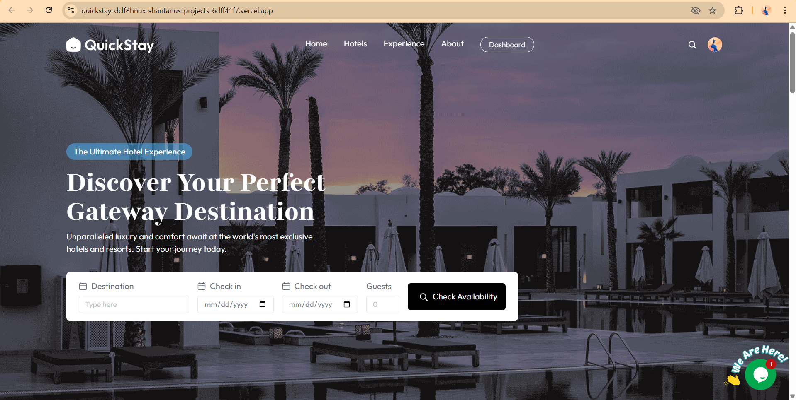

### Featured Destinations
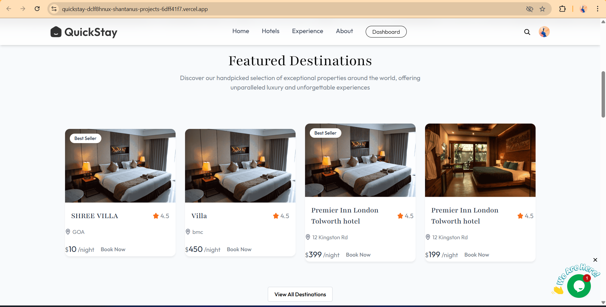

### Exclusive Offers
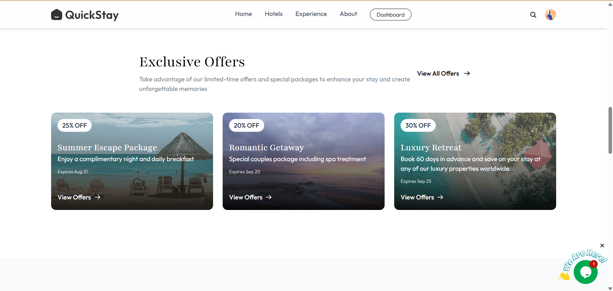

### Guest Testimonials
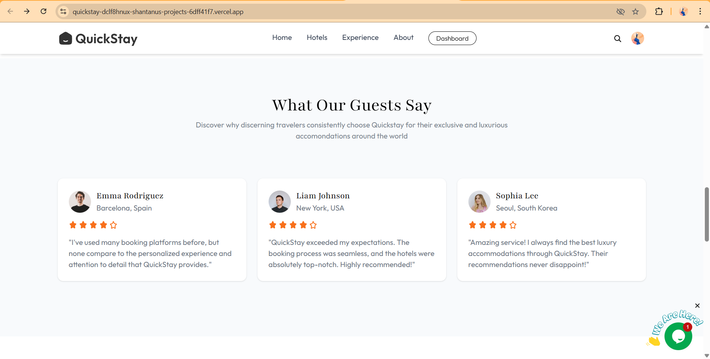

### FAQs
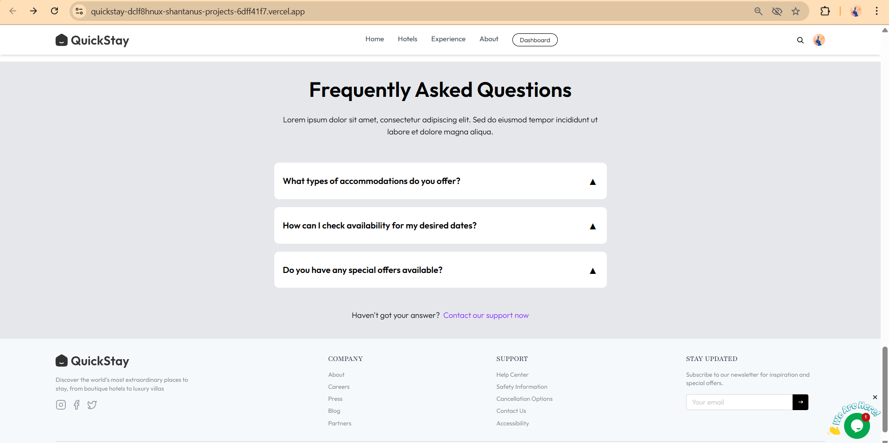

### Hotel Rooms Listing
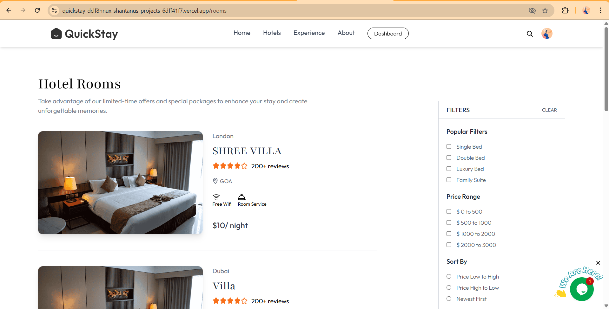

### Room Detail View
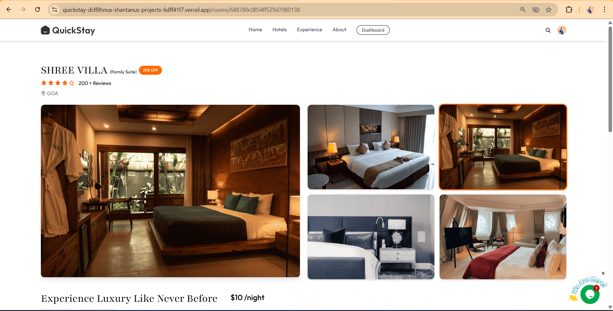

### Create an Account
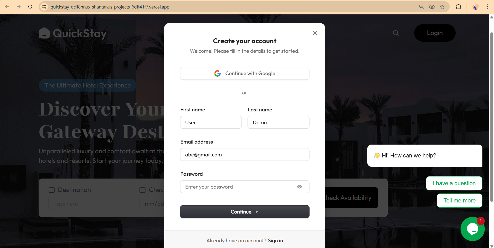

### Register Your Hotel
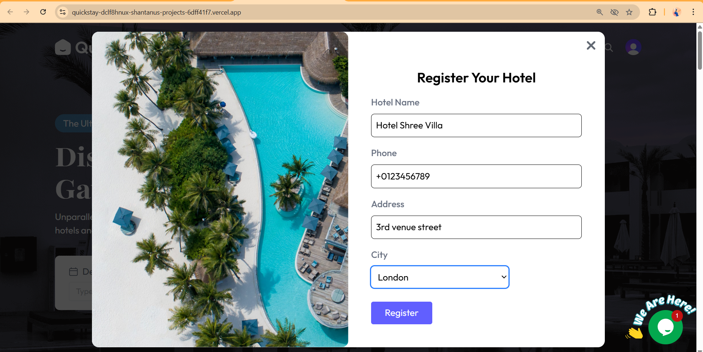

### Owner Dashboard
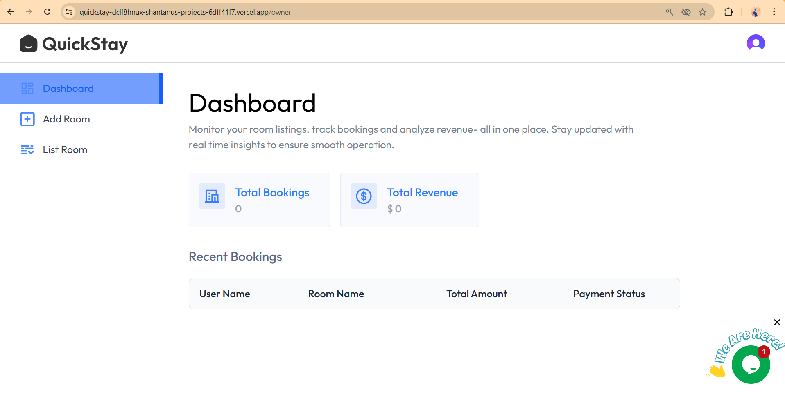

### Add Room
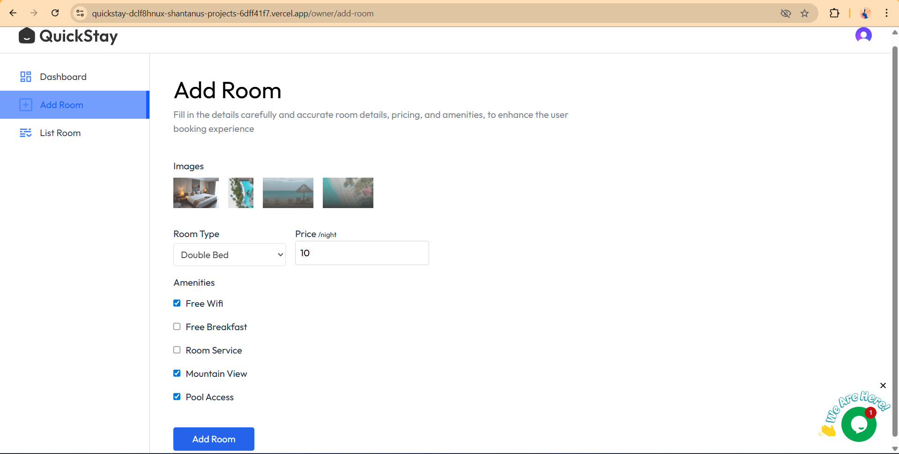

### Room Listings (Owner)
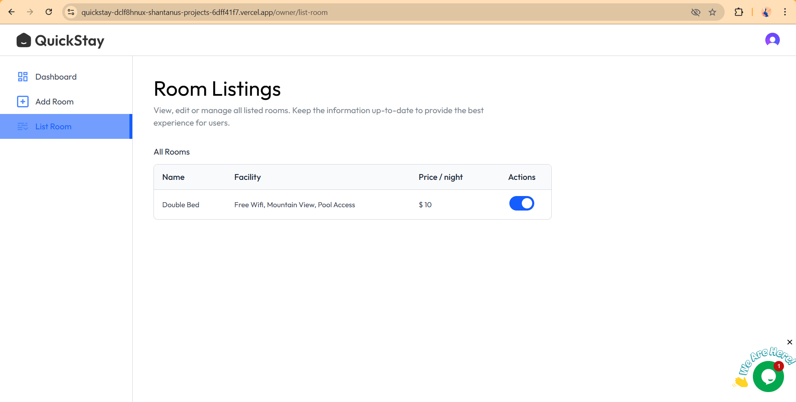

### My Bookings – Unpaid
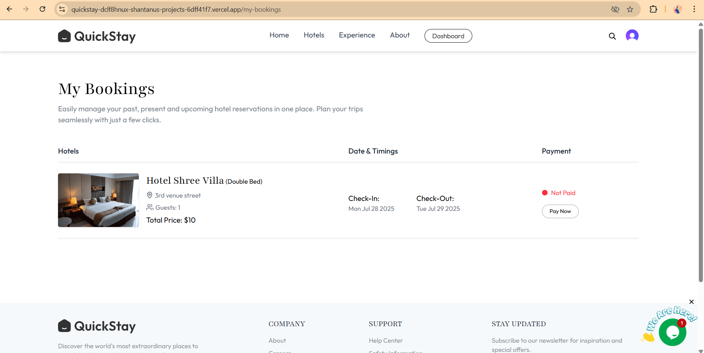

### My Bookings – Paid
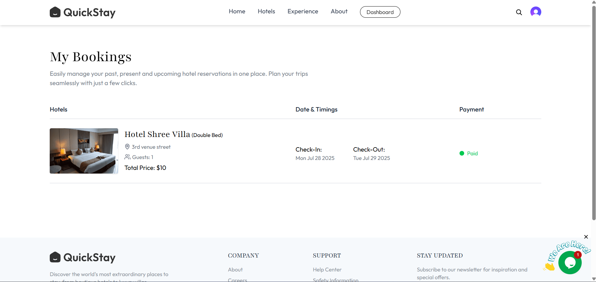

### Owner Dashboard with Live Chat
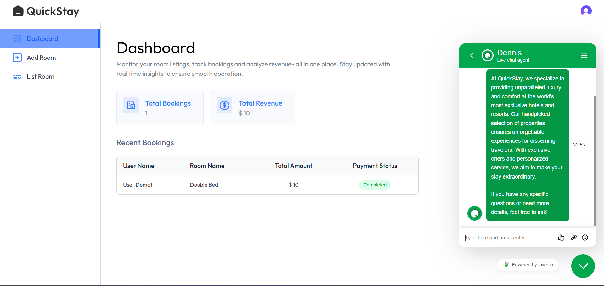
